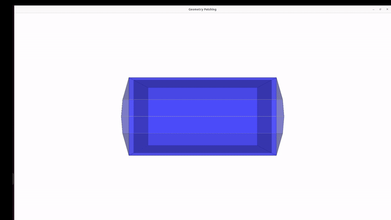

# Wireframe Face Patching

Interactive tool for closing faces on 3D building wireframes. Hover an edge, click a sequence of connected edges to form a closed loop, and the enclosed face is triangulated and committed automatically.


## Why
Automated mesh generation from wireframes leaves holes wherever the topology is degenerate, ambiguous, or simply when the optimiser can't go deep enough. Rewriting the generator to handle every case is not always worth it when the failures are a small fraction of a large batch. This tool covers the remainder. I.e., it lets you close the missing faces by hand, quickly, with the wireframe as the constraint so the patched geometry remains consistent with the source.

Built for repairing building wireframes, but works on any wireframe OBJ. You can also optionally load and visualise a mesh. New faces are appended to the existing ones.

If you have a mesh you want to repair but no wireframe it is simple to convert a mesh to a wireframe!
For example consider the following .obj structure (indices are implicit in a real .obj file, here are shown for clarity).
```
1 v x y z
2 v x y z
3 v x y z
4 v x y z
```
With a face mesh element
```
f 1 2 3 4
```
The face becomes the edges around its boundary:
```
l 1 2
l 2 3
l 3 4
l 4 1
```

Each face contributes an edge between consecutive vertices, closing back to the first.
Deduplicate edges shared between adjacent faces.

## Installation
### Locally:
```
git clone https://github.com/AndreasC95/mesh-patch-tool
cd mesh-patch-tool
pip install vtk==9.4.2
```
### Running in Docker


The tool opens a VTK window, so the container needs access to the host display. Tested on Linux/X11.

```bash

git clone https://github.com/AndreasC95/mesh-patch-tool
cd mesh-patch-tool

xhost +local:docker

docker run --rm -it \
  -e DISPLAY=$DISPLAY \
  -v /tmp/.X11-unix:/tmp/.X11-unix \
  -v "$PWD":/app \
  -w /app \
  ubuntu:24.04 bash
```

Inside the container:

```bash
apt update
apt install -y python3 python3-pip libgl1 libglx-mesa0 libxrender1 libxext6 libsm6 libx11-6 libxt6
pip3 install --break-system-packages vtk==9.4.2

python3 geometry_patching.py examples/gambrel_missing_sides.obj
```

Run `xhost -local:docker` afterwards to revoke display access.
## Usage
```
python3 geometry_patching.py examples/gambrel_missing_sides.obj
```
With an existing mesh drawn as backdrop, whose faces are carried into the output:
```
python3 geometry_patching.py examples/gambrel_missing_sides.obj -m examples/gambrel_missing_sides_mesh.obj
```

| Flag | Description |
|---|---|
| `-m`, `--mesh` | Optional mesh OBJ shown as context. Must share vertex ordering with the wireframe. |
| `-o`, `--output` | Output path. Defaults to `<wireframe-name>_faces.obj` in the working directory. |

## Controls

| Input | Action |
|---|---|
| Move mouse | Highlights the nearest edge within 8 px |
| Left click | Adds the highlighted edge to the current loop |
| Right drag | Rotate |
| Middle drag | Pan |
| `t` | Write the output OBJ |

A loop commits automatically once it closes. Edges must be clicked in sequence: each new edge has to connect to the head or tail of the chain built so far, and every vertex in the finished loop must have degree two. Edges that break either rule are rejected rather than silently accepted, which prevents self-touching loops. Loops can deviate from the face plane if a connected edge that belongs to a different face is selected.

## How it works
Once a loop closes, the face is triangulated by ear clipping in the loop's own plane:
1. The polygon normal is computed with Newell's method rather than a cross product over two edges. Newell's is stable for near-planar loops and does not depend on which pair of edges happens to be chosen, which matters because building wireframes are rarely perfectly planar.
2. An orthonormal basis is constructed from the normal, with a fallback when the seed vector is near-parallel, and the loop is projected to 2D.
3. Winding is normalised to counter-clockwise so the ear clipping test is well defined.
4. Ears are clipped with a containment test against all remaining vertices, so reflex corners on concave faces are handled correctly.
5. Triangles are emitted using original vertex ids, so the output indexes into the source wireframe and no new vertices are introduced.

Degenerate input is refused rather than patched over. The triangulator returns nothing when the loop is non-planar beyond tolerance, self-intersecting, collinear, or contains coincident vertices.
## Examples
examples/ contains wireframe and mesh pairs of two buildings:
- gambrel_missing_sides.obj is a building with the sides of the gambrel roof missing, a common repair case
- T_shape.obj is a complete mesh where a user can quickly test concave faces on the building footprint plane

Both are derived from the Point2Roof benchmark (Li et al. 2022).

## Known limitations
- The planarity tolerance is absolute, it needs to be changed based on the user's scale.
- Some edges are occasionally rejected during loop construction when they should be accepted.
- Concave faces can be formed in a way that violates the wireframe geometry under specific conditions.

